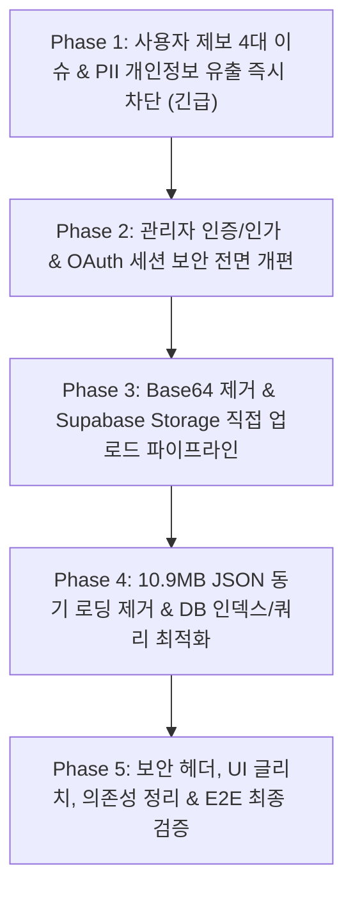

# 🏛️ 대대손손(daedaesonson) 전수조사 마스터 결함 보고서

> **작성 일시**: 2026-09-18  
> **조사 범위**: 53개 백엔드 API 라우트, 55개 프론트엔드 페이지/컴포넌트, DB 스키마, Vercel 인프라, 보안 아키텍처  
> **총 발견 결함**: **62건** (Critical 18건 / High 21건 / Medium 15건 / Low 8건)

---

## 📌 목차
1. [긴급 제보 결함 4대 핵심 원인 규명](#1-긴급-제보-결함-4대-핵심-원인-규명)
2. [Critical 심각도 취약점 및 결함 (18건)](#2-critical-심각도-취약점-및-결함-18건)
3. [High 심각도 결함 (21건)](#3-high-심각도-결함-21건)
4. [Medium 심각도 성능 및 아키텍처 결함 (15건)](#4-medium-심각도-성능-및-아키텍처-결함-15건)
5. [Low 심각도 및 코드 품질 결함 (8건)](#5-low-심각도-및-코드-품질-결함-8건)
6. [단계별 패치 로드맵 & 우선순위](#6-단계별-패치-로드맵--우선순위)

---

## 1. 긴급 제보 결함 4대 핵심 원인 규명

사용자께서 직접 체감하셨던 4대 결함("대손이 안 움직임", "직접상담신청 안 됨", "슬랙 알림 안 옴", "신청완료 후 레이아웃 깨짐")의 정확한 코드 레벨 원인은 다음과 같습니다:

### ① 대손이(챗봇)가 안 움직이고 멈추는 원인
- **원인 A (AI 모델 퇴역 및 크레딧 고갈)**:  
  `app/api/chat/route.ts:1024`에 지정된 `gemini-2.0-flash` 모델이 Google AI에서 공식 퇴역(404 Not Found)되었으며, API 키의 선불 크레딧이 소진(`429 Too Many Requests: Your prepayment credits are depleted`)되어 백엔드 API가 상시 500 에러를 뿜고 있었습니다.
- **원인 B (초기 퀵 리플라이 클릭 핸들러 누락)**:  
  `components/chatbot/AIChatbot.tsx:774`에서 "가격이 궁금해요", "위치·교통편" 등 초기 추천 질문 버튼 클릭 시 `setInput(q)`만 실행하고 `sendMessage(q)`를 호출하지 않아 인풋에 글자만 들어가고 전송되지 않았습니다.
- **원인 C (에러 시 UI 프리징)**:  
  `AIChatbot.tsx:647-664`에서 API 에러 응답 시 사용자에게 에러 안내 메시지를 띄우지 않고 로딩 인디케이터만 꺼버려 챗봇이 완전히 멈춘 것처럼 보였습니다.

### ② 직접 상담 신청이 안 되는 원인
- **원인 (선택 사항을 필수로 강제한 조건문)**:  
  `components/detail/FacilityDetail.tsx:3366` (모바일) 및 `3806` (데스크톱):
  ```tsx
  disabled={!consultForm.name || !consultForm.phone || !consultForm.preferredTime || !consultForm.consultMethod || !consultForm.question || !consultForm.message?.trim()}
  ```
  폼의 6단계는 **"6. 추가 요청사항 (선택사항)"**임에도 불구하고 `!consultForm.message?.trim()`이 버튼 비활성화 조건에 강제되어 있었습니다. 사용자가 이름, 전화번호, 시간, 방식을 다 선택해도 추가 메모를 쓰지 않으면 버튼이 영구히 비활성화(회색)되어 신청할 수 없었습니다.

### ③ 슬랙 알림이 안 오는 원인
- **원인 (슬랙 웹훅 문제가 아닌 폼/챗봇 미제출)**:  
  슬랙 웹훅 자체는 정상 동작(200 OK)하지만, ①번(챗봇 에러)과 ②번(상담 버튼 비활성화)으로 인해 **실제 신청 데이터가 서버로 전송되지 못하여 슬랙 알림 발송 트리거 자체가 실행되지 않았던 것**입니다.

### ④ 신청 완료 후 레이아웃이 깨지는 원인
- **원인 A (Drawer 닫힘 도중 완료 카드 언마운트)**:  
  `FacilityDetail.tsx:3080`: 완료 화면에서 [확인] 버튼을 누르면 Mantine Drawer가 닫히는 애니메이션(300ms) 도중에 `setConsultSuccess(false)`가 즉시 실행되어 닫히는 도중 6단계 폼과 하단 고정 버튼(`fixed bottom: 0`)이 화면에 번쩍이며 겹쳤습니다.
- **원인 B (독립 라우트 `/facility/[id]/consult` 화면 잠김)**:  
  `app/facility/[id]/consult/page.tsx`는 컨테이너가 `height: 100dvh, position: fixed, overflow: hidden`으로 고정되어 있습니다. Drawer를 닫아도 URL이 `/consult`에 머물러 있어 빈 상세화면이 화면 전체를 덮은 채 갇히게 되었습니다.

---

## 2. Critical 심각도 취약점 및 결함 (18건)

### [CRIT-01] 관리자 세션 토큰 하드코딩 및 우회
- **위치**: `lib/adminAuth.ts:4`, `middleware.ts:3`, `app/api/admin/auth/route.ts:4`
- **내용**: 고정 문자열 `'dds_admin_verified'`를 토큰으로 사용. 브라우저 콘솔에서 `document.cookie="admin_session=dds_admin_verified"` 입력 시 서버 서명 검증 없이 즉시 관리자 권한 획득.

### [CRIT-02] 관리자 전용 14개 API 라우트 인증 검증 누락
- **위치**: `app/api/admin/members`, `chat-logs`, `chat-stats`, `consults`, `facilities`, `faqs`, `faqs/[id]`, `inquiries`, `inquiries/count`, `policies/[type]`, `pricing`, `recommendations`, `reviews`, `stats`
- **내용**: 미들웨어만 믿고 라우트 내부 `requireAdmin()` 검증 부재. `DELETE /api/admin/members` 호출 시 임의의 회원 계정 삭제 가능, `GET /api/admin/members` 호출 시 전체 회원 개인정보 덤프 가능.

### [CRIT-03] 고객 전화번호 및 4자리 문의 PIN 평문 유출 (PII Leak)
- **위치**: `app/api/facilities/[id]/inquiries/route.ts:30-34`, `app/api/facilities/[id]/route.ts:124, 197`
- **내용**: 비밀글 마스킹 시 `...item` 스프레드 연산자로 전체 컬럼을 복사하여 작성자의 전체 전화번호와 4자리 비밀번호(`passwordLast4`)가 공개 JSON에 그대로 노출. 노출된 PIN으로 타인의 문의를 삭제하거나 잠금 해제 가능.

### [CRIT-04] 리뷰 삭제 및 작성 시 클라이언트 userId 사칭
- **위치**: `app/api/facilities/[id]/review/route.ts:18, 159`
- **내용**: `body.userId === review.userId`를 토큰 검증 없이 신뢰하여 타인의 `userId`를 JSON 본문에 넘기는 것만으로 임의의 사용자 리뷰 삭제 및 사칭 작성 가능.

### [CRIT-05] 어드민 시설 검색 PostgREST 필터 인젝션
- **위치**: `app/api/admin/facilities/route.ts:48`
- **내용**: `query.or(...)` 내에 사용자 검색어를 이스케이프 없이 직접 삽입하여 PostgREST 문법 제어 문자(`,`, `()`, `.`)를 주입해 쿼리 구조 변조 및 500 크래시 유발 가능.

### [CRIT-06] 카카오 OAuth 세션 토큰 URL 쿼리 파라미터 노출
- **위치**: `app/auth/callback/route.ts:128-134`
- **내용**: 로그인 완료 후 Supabase `access_token` 및 `refresh_token`을 Base64로 감싸 `/?kakao_session=...` URL 쿼리에 실어 리다이렉트. 브라우저 히스토리, Referer 헤더, 웹서버 로그, 외부 분석 스크립트에 토큰 유출.

### [CRIT-07] 전화번호 및 카카오 계정의 결정론적 비밀번호 생성
- **위치**: `app/api/auth/verify-otp/route.ts:60`, `app/auth/callback/route.ts:50`
- **내용**: 비밀번호를 `kakao_${kakaoId}_${serviceKey.slice(0, 12)}` 형식으로 고정 생성. 서비스 키 앞자리가 유출될 경우 모든 유저 계정을 임의로 직접 로그인 가능.

### [CRIT-08] SMS OTP 인증번호 재사용(Replay) 및 예측 가능 난수
- **위치**: `app/api/auth/send-otp/route.ts:9`, `app/api/auth/verify-otp/route.ts:40-58`
- **내용**: `verified: true`로 업데이트되지만 검증 로직에서 `otpData.verified === true`인지 확인하지 않아 5분 내 다중 재사용 가능. OTP 생성에 `Math.random()` 사용.

### [CRIT-09] 10.9MB facilities.json 단일 SSR 요청당 2회 중복 동기 로드
- **위치**: `app/facility/[id]/page.tsx:16-25, 30, 128`
- **내용**: `generateMetadata`와 `FacilityPage`에서 10.9MB 파일을 각각 `fs.readFileSync` 및 `JSON.parse`하여 1회 요청당 120~160MB 힙 메모리 급증 및 이벤트 루프 블로킹.

### [CRIT-10] 정보수정 요청 시 최대 10장 고해상도 이미지 Base64 DB 삽입 (HTTP 413)
- **위치**: `components/detail/CorrectionRequestModal.tsx:45-51`, `app/api/corrections/route.ts:28`
- **내용**: 고화질 사진을 Base64로 JSON 본문에 담아 전송하여 Vercel 4.5MB 한도 초과(413 Payload Too Large)로 요청 실패. DB 컬럼에 수십 MB 텍스트 직접 저장.

### [CRIT-11] 리뷰 작성 시 사진 Base64 저장 및 상세페이지 로딩 시 수십 MB 재전송
- **위치**: `components/detail/FacilityDetail.tsx:1386`, `app/api/facilities/[id]/review/route.ts:60`
- **내용**: 리뷰 사진을 Base64로 DB에 저장하고, 시설 상세페이지 조회 시마다 모든 리뷰의 Base64 원본을 내려주어 네트워크 대역폭 고갈 및 브라우저 프리징.

### [CRIT-12] /api/facilities 호출 시 전체 시설 테이블 1,000건 무한 루프 풀스캔
- **위치**: `app/api/facilities/route.ts:80-99`, `app/page.tsx:14-27`
- **내용**: `force-dynamic` 상태에서 매 요청마다 전체 시설을 1,000개씩 순차 페이징하여 DB 왕복 통신 반복.

### [CRIT-13] PriceCategory 테이블 전체 레코드 메모리 카운트 풀스캔
- **위치**: `app/api/facilities/route.ts:102-111`
- **내용**: 단지 시설별 가격 존재 여부를 알기 위해 `PriceCategory` 전체 테이블(수만 건)을 SELECT하여 Node.js 메모리에서 루프 순회.

### [CRIT-14] 비공개 문의 PIN 모달 z-index 충돌로 조작 불가
- **위치**: `components/detail/InquiryPanel.tsx:217 vs 372`
- **내용**: 부모 Drawer(`zIndex: 10010`) 뒤에 비밀번호 입력 모달(`zIndex: 9999`)이 렌더링되어 모달이 가려져 입력 불가.

### [CRIT-15] 상담신청 6단계 메모 미입력 시 버튼 영구 비활성화
- **위치**: `components/detail/FacilityDetail.tsx:3366, 3806`
- **내용**: 선택 항목인 6단계 메모 미입력 시 `disabled`가 유지되어 폼 제출 불가.

### [CRIT-16] 챗봇 초기 추천 질문 클릭 시 API 호출 누락
- **위치**: `components/chatbot/AIChatbot.tsx:774`
- **내용**: 추천 질문 클릭 시 `sendMessage()`가 호출되지 않아 무반응.

### [CRIT-17] 챗봇 상담 로그 API 관리자 인증 누락
- **위치**: `app/api/admin/chat-logs/route.ts:7-19`
- **내용**: 외부 비인가자가 전체 챗봇 상담 내역, 유저 IP, User-Agent 무단 열람 및 변조 가능.

### [CRIT-18] 구글 Gemini 2.0 Flash 모델 퇴역으로 인한 챗봇 상시 500 에러
- **위치**: `app/api/chat/route.ts:1024`
- **내용**: Google API에서 `gemini-2.0-flash` 모델이 삭제되어 호출 시 404 에러 발생.

---

## 3. High 심각도 결함 (21건)

1. **[HIGH-01] SMS 인증번호 발송 전화번호별 속도 제한 부재**: IP 기반 제한만 있어 전화번호 하나를 대상으로 Solapi SMS 폭탄 발송 및 비용 소진 공격 가능. (`app/api/auth/send-otp/route.ts:19`)
2. **[HIGH-02] 챗봇 히스토리 무제한 주입으로 Gemini 토큰 고갈 공격 가능**: 클라이언트가 전송하는 `history` 배열 크기 및 글자 수 제한이 없어 API 토큰 비용 폭증 유발. (`app/api/chat/route.ts:318`)
3. **[HIGH-03] 관리자 API에 `Cache-Control: public` 설정**: `admin/inquiries`, `admin/reviews` 응답에 `public` 캐시가 설정되어 CDN/프록시에 민감 정보 캐싱 위험. (`app/api/admin/inquiries/route.ts:48`)
4. **[HIGH-04] 4자리 문의 PIN 및 관리자 비밀번호 무차별 대입 방어 부재**: `inquiries/verify` 및 `admin/auth`에 Rate Limit이 없어 10,000개 조합을 30초 내 무차별 대입 가능.
5. **[HIGH-05] 리뷰 좋아요/싫어요 무제한 투표 조작**: 유저나 IP 기록 없이 카운트만 증감시켜 무한 반복 조작 가능. (`app/api/reviews/interact/route.ts:32`)
6. **[HIGH-06] 리뷰 삭제 시 시설 평균 평점 미재계산**: 리뷰 삭제 시 개수는 줄어드나 평균 평점이 갱신되지 않아 평점 왜곡 발생. (`app/api/facilities/[id]/review/route.ts:191`)
7. **[HIGH-07] 가격표 일괄 교체 시 비트랜잭션(Non-transactional) 처리**: 기존 가격 삭제 후 새 가격 삽입 중 오류 발생 시 가격 데이터 영구 유실. (`app/api/facilities/route.ts:354`)
8. **[HIGH-08] 검색 및 지역별 페이지 런타임 10.9MB 동기 파싱**: `/search/[city]/[category]` 및 `/region/[slug]` 요청마다 10.9MB 동기 파싱.
9. **[HIGH-09] sitemap.ts 내 동일 파일 2회 중복 파싱**: 사이트맵 생성 시 10.9MB 파일을 연달아 2회 파싱하여 메모리 급증.
10. **[HIGH-10] 10.9MB JSON을 Next.js 번들에 정적 import**: `facilities-v2/route.ts` 및 `inquiries/page.tsx`에서 전체 JSON을 import하여 람다 번들 20MB+ 비대화.
11. **[HIGH-11] 챗봇 대화 시 이미지 Base64 매 턴 누적 전송**: 대화에 첨부된 Base64 이미지가 `history`에 남아 매 요청마다 수 MB 전송. (`AIChatbot.tsx:183`)
12. **[HIGH-12] 리뷰 대댓글 사진 Base64 DB 삽입**: `Reply.photos`에 Base64 직접 저장. (`ReviewsPanel.tsx:63`)
13. **[HIGH-13] Supabase 핵심 테이블 외래키 및 정렬 인덱스 누락**: `Review`, `Inquiry`, `favorites` 등 주요 테이블에 인덱스가 없어 데이터 증가 시 Seq Scan 발생.
14. **[HIGH-14] 관리자 UI 경로(`/admin/*`) 서버사이드 미들웨어 미적용**: 미들웨어가 `/api/admin`만 보호하고 `/admin` 페이지 경로는 보호하지 않음. (`middleware.ts:29`)
15. **[HIGH-15] 소스코드 내 Supabase Anon Key 및 카카오 REST 키 하드코딩**: `lib/supabase.ts:8-9`, `AuthProvider.tsx:140`.
16. **[HIGH-16] 보안 HTTP 헤더(CSP, HSTS, X-Frame-Options) 완전 누락**: `next.config.mjs`에 `headers()` 설정 부재로 클릭재킹 및 스니핑 취약.
17. **[HIGH-17] 모바일 전역 non-passive touchend 리스너로 터치 씹힘**: 300ms 이내 터치 강제 취소로 탭 이벤트 씹힘. (`app/layout.tsx:156`)
18. **[HIGH-18] 신청 완료 후 Drawer 닫힘 도중 폼 번쩍임 글리치**: 애니메이션 도중 완료 카드 파괴로 인한 레이아웃 깨짐. (`FacilityDetail.tsx:3080`)
19. **[HIGH-19] 독립 라우트 `/facility/[id]/consult` 완료 후 화면 잠김**: Drawer를 닫아도 URL이 유지되어 100dvh 고정 화면에 고립.
20. **[HIGH-20] 챗봇 비회원 10턴 초과 시 알림 없는 사일런트 리턴**: 10턴 소진 시 안내 없이 무반응. (`AIChatbot.tsx:174`)
21. **[HIGH-21] 시설 표준가격 데이터 rows undefined 런타임 크래시**: 일부 시설의 `g.rows`가 없을 때 `.map` 호출로 화면 크래시. (`FacilityDetail.tsx:4660`)

---

## 4. Medium 심각도 성능 및 아키텍처 결함 (15건)

1. **[MED-01] 24개 라우트에서 500 에러 시 원시 DB 에러 메시지(테이블명, 제약조건) 클라이언트 노출**.
2. **[MED-02] 관리자 목록 조회 API(상담, 제휴, 수정요청, 챗봇)에 LIMIT 및 페이지네이션 부재**.
3. **[MED-03] 로그인 시 `listUsers({ perPage: 1000 })` 전체 유저 순회**: 유저 1,000명 초과 시 계정 충돌 및 500 에러.
4. **[MED-04] 시설 조회수 조작 로직 및 Race Condition**: 카운트 0일 때 50~500 임의 숫자 조작 및 동시성 잠금 경합.
5. **[MED-05] Vercel Serverless에서 백그라운드 fire-and-forget Promise 유실**: 응답 반환 후 슬랙 발송 및 조회수 갱신 프로세스 강제 종료.
6. **[MED-06] 파일 업로드 시 클라이언트 파일명 확장자 무검증 신뢰**: MIME-type 대신 `file.name` 확장자 추출.
7. **[MED-07] Serverless 환경에서 인메모리 Map Rate Limiter 무력화**: 다중 람다 인스턴스 간 메모리 미공유로 제한 우회.
8. **[MED-08] `.vercelignore` 누락으로 100MB+ 백업/더미 데이터 배포 번들 포함**.
9. **[MED-09] Supabase Storage 업로드 API가 관리자 전용으로 막혀 일반 유저 사용 불가**.
10. **[MED-10] AI 챗봇 콜드 스타트 시 10.9MB 동기 파싱으로 첫 응답 지연**.
11. **[MED-11] 전역 `body { user-select: none; }` 설정으로 시설 주소/가격 텍스트 복사 차단**.
12. **[MED-12] 모바일 `100vh` 사용으로 주소창 확장 시 하단 컨텐츠 잘림 (`100dvh` 미사용)**.
13. **[MED-13] SSR Hydration 불일치**: `generateRandomNickname()`의 `Math.random()`, `sessionStorage` 직접 초기화.
14. **[MED-14] 숨김 페이지에서 FAB 숨김 후에도 2초 뒤 말풍선만 공중에 뜨는 유령 버그**.
15. **[MED-15] 데스크톱 상세페이지 좌측 FAB 클릭 시 챗봇 창이 우측 끝에서 열리는 동선 분리**.

---

## 5. Low 심각도 및 코드 품질 결함 (8건)

1. **[LOW-01] 관리자 기본 비밀번호 4자리 PIN(`0612`) 폴백 잔존**.
2. **[LOW-02] 상태값(status) 변경 시 허용 Enum 검증 부재**.
3. **[LOW-03] 에러 발생 시 로그 없이 빈 객체 반환하는 사일런트 캐치 블록 다수**.
4. **[LOW-04] PDF/이미지 분석 라우트에 실험용 퇴역 모델(`gemini-2.0-flash-exp`) 잔존**.
5. **[LOW-05] e-하늘 정부 포털 크롤러 호출 시 타임아웃 미설정 (서버 멈춤 위험)**.
6. **[LOW-06] 미사용 고아 컴포넌트(`StoryPanel.tsx`, `PriceSummaryTab.tsx`) 방치**.
7. **[LOW-07] 카드 컴포넌트에 빈 `onClick={() => {}}` 전달로 클릭 반응 없음**.
8. **[LOW-08] `npm audit` 34개 취약점 (Critical: `protobufjs`, `tar`, High: `sharp`, `undici`, `ws`, `xlsx`)**.

---

## 6. 단계별 패치 로드맵 & 우선순위



### 1단계: 긴급 패치 (오늘 즉시 조치)
1. **상담 신청 폼**: `FacilityDetail.tsx`의 `disabled` 조건에서 `!consultForm.message?.trim()` 제거 (즉시 신청 가능화).
2. **대손이 챗봇**:
   - `AIChatbot.tsx:774`에 `sendMessage(q)` 연동.
   - `app/api/chat/route.ts:1024`의 AI 모델을 지원 모델(`gemini-2.5-flash`)로 교체 및 429/에러 폴백 텍스트 제공.
   - 에러 발생 시 UI 프리징 방지 처리.
3. **신청 완료 후 레이아웃**:
   - Drawer 닫기 시 350ms 딜레이 후 `consultSuccess` 초기화.
   - `/facility/[id]/consult`에서 완료 시 `router.replace('/facility/' + id)` 실행.
4. **개인정보 유출 차단**:
   - `facilities/[id]/inquiries`, `facilities/[id]`, `inquiries`에서 `phone`, `passwordLast4` 필드 완전 제거.
5. **PIN 모달 z-index**:
   - `InquiryPanel.tsx` 모달 `zIndex`를 `10020`으로 수정.

### 2단계: 인증 & 보안 강화 (단기)
1. 14개 관리자 API에 `requireAdmin()` 일괄 적용.
2. 고정 토큰(`dds_admin_verified`)을 서명된 JWT 쿠키 세션으로 변경하고 `ADMIN_PASSWORD` 강제화.
3. 카카오 OAuth 리다이렉트 시 `?kakao_session=` 쿼리를 제거하고 `httpOnly` 쿠키로 세션 전달.
4. 리뷰 삭제 및 작성 시 `body.userId` 대신 Bearer JWT 토큰 검증 적용.
5. `admin/facilities` 검색창 PostgREST 필터 인젝션 방어.

### 3단계: 성능 & 아키텍처 최적화 (중기)
1. 리뷰 및 정정요청의 Base64 이미지 변환을 폐기하고 Supabase Storage 업로드 파이프라인 구축.
2. `facility/[id]/page.tsx` 등에서 10.9MB JSON 동기 읽기를 제거하고 Supabase 단건 쿼리 및 React `cache()` 적용.
3. `Facility` 테이블 1,000개 순회 풀스캔 제거 및 지도 마커 경량 JSON 서빙.
4. `.vercelignore`에 100MB 불필요 백업 데이터 제외.
5. `next.config.mjs`에 CSP, HSTS, X-Frame-Options 보안 헤더 등록.
